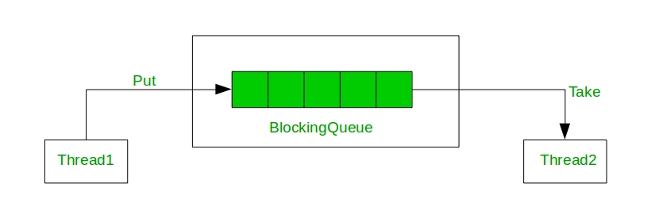

>자바 5부터 제공되는 java.util.concurrent 패키지는 멀티스레드 환경에서 안전하게 사용할 수 있는 컬렉션 프레임워크를 제공한다.
그중에는 ReentrantLock, Condition, Semaphore, CountDownLatch, BlockingQueue 등 다양한 클래스와 인터페이스가 있다.
오늘은 BlockQueue 인터페이스를 구현한 ArrayBlockingQueue에 대해 알아보며, 내부 코드를 살펴보면서 
ReentrantLock과 Condition에 대해 알아보려고 한다.

## 💬 ArrayBlockingQueue


`BlockingQueue`는 `Queue` 인터페이스를 상속받아서 큐의 기본적인 동작(FIFO)을 제공하며 
큐가 비어있을 때 요소를 가져오려고 하면 요소가 들어올 때까지 기다리게 하는 기능과
큐가 가득찼을때, 요소를 삽입하려고 하면 요소가 빠질때까지 기다리게 하는 기능을 제공한다.
주로 생산자-소비자 패턴에서 사용되며, 멀티스레드 환경에서 안전하게 사용할 수 있는 큐이다.

`ArrayBlockingQueue`는 `BlockingQueue`의 구현체로, 이름에서 알 수 있듯이 내부에서 데이터의 보관을 배열로 관리한다. 
또한 멀티스레드 환경에서 안전하게 사용하기 위해 `ReentrantLock`과 `Condition`를 사용한다.

## 💬 ReentrantLock
`ReentrantLock`은 `Lock` 인터페이스를 구현한 클래스이다. `ReentrantLock`은 `synchronized` 키워드와 같은 동기화 기능을 제공한다.
기본적으로 `ReentrantLock`은 `monitor`보다 더 확장된 기능을 제공한다.

`synchronized`와 다른 점은 다음과 같다.
1. `ReentrantLock`은 `synchronized` 키워드보다 더 높은 확장성을 제공한다.
2. 명시적인 락의 획득과 해제
3. `Condition`을 사용하여 두개이상의 조건을 지정할 수 있다.
4. `tryLock()` 메서드를 사용하여 락을 획득할 수 있는지 확인할 수 있다.
5. fair lock을 지원한다.

기본적으로 다음과 같이 사용할 수 있다.
```java
public class ReentrantLockExample {
    private final ReentrantLock lock = new ReentrantLock();
    private int count = 0;

    public void increment() {
        lock.lock(); //명시적 락 획득
        try {
            count++;
        } finally {
            lock.unlock(); //명시적 락 해제
        }
    }

    public int getCount() {
        lock.lock();
        try {
            return count;
        } finally {
            lock.unlock();
        }
    }
}
```

사실 이미 `synchronized` 키워드를 사용하여 동기화를 제공하는 방법을 알고 있다면 `ReentrantLock`을 이해하고 사용하는데는 큰 어려움이 없지만,
`ArrayBlockingQueue`의 내부 코드를 살펴보면서 `ReentrantLock`과 `Condition`을 사용하는 예제를 확실하게 살펴보려한다.

## 💬 ArrayBlockingQueue 내부 코드

### 📍주요 필드
```java
public class ArrayBlockingQueue<E> extends AbstractQueue<E>
        implements BlockingQueue<E>, java.io.Serializable {
    
	private final ReentrantLock lock;
    private final Condition notEmpty;
    private final Condition notFull;
    private final Object[] items;
}
```
앞서 설명한 것 처럼, `mutex`로 `ReentrantLock`을 사용하고, `Condition`을 사용하여 가득 찼을 때, 비어있을 때 두 가지 상황을 나타낸다.

### 📍주요 생성자
```java
public ArrayBlockingQueue(int capacity, boolean fair) {
    if (capacity <= 0)
        throw new IllegalArgumentException();
    this.items = new Object[capacity];
    lock = new ReentrantLock(fair);
    notEmpty = lock.newCondition();
    notFull =  lock.newCondition();
}
```
ArrayBlockingQueue를 생성할 때, fair lock 사용여부를 설정할 수 있다. 생성자 블록에서 객체가 가지는 lock과 condition을 초기화한다.

### 📍offer 메서드
두개의 `offer`메서드를 제공한다.
```java
1. public boolean offer(E e);
2. public boolean offer(E e, long timeout, TimeUnit unit);
```
1번 메서드는 큐가 가득차면 대기하지않고 즉시 false를 반환하고 2번 메서드는 큐가 가득차면 지정한 timeout 동안 대기하고, timeout이 지나면 false를 반환한다.

1번메서드와 2번 메서드의 구현은 다음과 같다.
```java
//1번 메서드
public boolean offer(E e) {
	Objects.requireNonNull(e);
	final ReentrantLock lock = this.lock;
	lock.lock();
	try {
		if (count == items.length) //현재 큐가 가득찼으면 그 즉시 false 반환
			return false;
		else {
			enqueue(e);
			return true;
		}
	} finally {
		lock.unlock();
	}
}

//2번 메서드
public boolean offer(E e, long timeout, TimeUnit unit) throws InterruptedException {
    Objects.requireNonNull(e);
    long nanos = unit.toNanos(timeout);
    final ReentrantLock lock = this.lock;
    lock.lockInterruptibly();
    try {
        while (count == items.length) { //큐가 가득찼을때
            if (nanos <= 0L)
                return false;
            nanos = notFull.awaitNanos(nanos); //lock을 해제하고 notFull condition을 기다림
        }
        enqueue(e);
        return true;
    } finally {
        lock.unlock();
    }
}
```
1번과 2번의 차이는 큐가 가득찼을때의 처리이다. 큐가 가득찼을때 1번 메서드는 즉시 false를 반환하고 2번 메서드는 지정한 시간동안 대기한다.
2번메서드에서는 `lock.lockInterruptibly()`를 사용하여 락을 획득하고, 큐가 가득찼을때 `notFull.awaitNanos(nanos)`를 사용하여 획득한 락을 해제하고 대기한다.
만약 `notFull` condition의 signal이 호출되어 깨어나면 가장 먼저 <u>다시 락을 획득</u>한 후, 남은 nanos를 다시 계산한 후 while문을 수행한다.

여기서 왜 2번메서드에서 `lock.lockInterruptibly()`를 사용하는지 궁금할 수 있다. 우선 `lock.lock()`을 사용하면 스레드가 락을 획득하기위해 대기하고 있을때,
다른 스레드가 `interrupt()`를 호출하면 `lock.lock()`은 `InterruptedException`을 발생시키지 않고 락의 획득을 계속 시도하게 된다.
반면, `lock.lockInterruptibly()`를 사용하면 다른 스레드가 `interrupt()`가 호출했을 때 `InterruptedException`을 발생시킨다.
따라서 무한정 대기하는 상황을 막는다.

+ 1번메서드는 큐가 가득찼을때 대기하지않고 <u>즉시</u> false를 반환한다. 따라서 락의 획득을 위해 대기하는 찰나의 순간을 고려해서까지
`interrupt`를 고려할 필요가 없다.
+ 2번메서드는 큐가 가득찼을때 대기한다. 이때는 `interrupt`를 고려할 만한 충분한 대기시간이 주어진다고 판단 할 수 있으므로, `lock.lockInterruptibly()`를 사용한다.


만약 현재 큐가 가득 찬 상황이 아니라면 `enqueue()`를 호출하여 큐에 집어넣는다.
```java
private void enqueue(E e) {
    final Object[] items = this.items;
    items[putIndex] = e;
    if (++putIndex == items.length) putIndex = 0;
    count++;
    notEmpty.signal();
}
```
주목할 부분은 `notEmpty.signal()`이다. 큐에 데이터가 들어갔으므로 `notEmpty` condition을 기다리고 있는 스레드<u>하나</u>를 깨운다.

### 📍poll 메서드
poll의 경우 offer의 경우와 정확히 반대되는 동작을 한다.

```java
1. public E poll();
2. public E poll(long timeout, TimeUnit unit);
```

2번 메서드의 구현은 다음과 같다.
```java
public E poll(long timeout, TimeUnit unit) throws InterruptedException {
    long nanos = unit.toNanos(timeout);
    final ReentrantLock lock = this.lock;
    lock.lockInterruptibly();
    try {
        while (count == 0) {
            if (nanos <= 0L)
                return null;
            nanos = notEmpty.awaitNanos(nanos);
        }
        return dequeue();
    } finally {
        lock.unlock();
    }
}
```
이번에는 큐가 비어있을때 획득한 락을 해제하고 대기상태로 들어간다. `notEmpty` condition의 signal이 호출되어 깨어나면 가장 먼저 <u>다시 락을 획득</u>한 후, 남은 nanos를 다시 계산한 후 while문을 수행한다.

```java
private E dequeue() {
    final Object[] items = this.items;
    E e = (E) items[takeIndex];
    items[takeIndex] = null;
    if (++takeIndex == items.length) takeIndex = 0;
    count--;
    if (itrs != null)
        itrs.elementDequeued();
    notFull.signal();
    return e;
}
```
큐에서 데이터를 꺼내면 더이상 큐가 가득찬 상태가 아니므로 `notFull` condition을 기다리고 있는 스레드를 깨운다.

## 💬 결론
`ArrayBlockingQueue`는 동기화문제를 해결하기위한 `mutext`로 `ReentrantLock`을 사용하였고,
`Condition`을 사용하여 큐가 가득찼을때와 비어있을때 두가지 조건을 구현하였다.

`synchronized`키워드 또한 `wait`,`notify`같은 메서드를 사용하여 특정 조건에대한 대기와 깨움을 구현 할 수 있지만,
하나의 조건에 국한된다.
반면 `ReentrantLock`과 `Condition`을 사용하면 두개 이상의 조건을 지정할 수 있고 fair lock 지원, lock.lockInterruptibly() 등의
유연한 처리를 할 수 있다.

---
## 참고
https://github.com/JetBrains/jdk8u_jdk/blob/master/src/share/classes/java/util/concurrent/ArrayBlockingQueue.java
