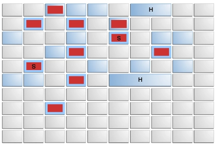
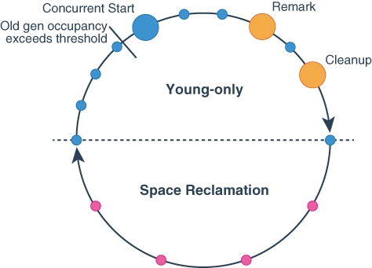

자바 개발자는 JVM에서 메모리의 할당과 해제를 모두 관리하는 가비지 컬렉션 덕분에 메모리 관리 이외의 관심사에 더 집중할 수 있다. 한편으론 
메모리 문제가 터졌을때, 개발자가 해결할 수 있는 범위가 제한적이라는 단점도 분명히 존재한다.

가비지 컬렉션을 가장 처음 사용한 언어는 1960년대에서 개발된 "리스프"이다. 그로부터 반세기가 지난 현재의 가비지 컬렉션 기술은 상당히 많은것들이 
<b>자동화</b>되었다. 현대의 가비지 컬렉터들은 긴 시간 진보를 거듭하며, 발전한 덕에 내부 동작이 복잡해지고 사용자가 이해하기 난해해 졌지만,
기본적인 동작 방식을 이해하는 것은 메모리 오버플로우나 누수문제를 해결하는데 도움을 준다. 이번 글에서는 JDK 8 업데이트 40 이후 공식 가비지 컬렉터로
자리잡은 `G1` 컬렉터의 동작 방식을 알아본다.

## G1 컬렉터란
G1의 의미는 `Garbage First` 즉 <u>가비지 우선</u>을 의미한다. G1 컬렉터는 JDk 6에서 얼리 억세스 형태로 배포 되었으며, JDK 8 업데이트 40에서
공식적으로 완전한 기능을 지원하게 되었다. JDK 9버전에 이르러서는 `default` 컬렉터로 지정되었다.

그렇다면 `G1` 컬렉터는 어떻게해서 기본 컬렉터로 자리잡게 되었을까? 그 이유는 `G1`의 <u>부분회수</u>와 <u>리전 단위의 메모리 레이아웃</u>에 있다.

## 리전 단위 메모리 레이아웃


G1의 리전 단위 메모리 레이아웃은 그림에서와 같이 전체 힙을 동일한 크기의 여러 `region`으로 나눈다. 각 리전은 `필요에 따라` 에덴 영역 혹은 서바이버 영역 혹은 구세대 공간으로 사용될 수 있다.
동적으로 할당한다는 의미이다. 하지만 리전의 크기는 고정 되어있기때문에 리전의 크기보다 큰 객체가 생성되는 경우가 있을 수 있다. 이때 g1은
`거대 객체`라는 표현을 사용하며 연속된 리전을 이어 붙인 형태로 관리한다. 

> 거대 객체는 일반 객체와 달리 G1에서 특별 취급하여 관리 한다.

G1 등장 이전까지 모든 컬렉터의 메모리 회수범위는 `young gen`, `old gen`, `total heap` 이 세가지에 국한 됐다. 하지만 리전 단위를 사용한 G1 컬렉터는
회수 대상을 `가장 쓰레기가 많은 리전`과 `회수 했을때 가장 이득이 큰 리전`이 기준이 된다. 즉, 힙의 모든 영역이 회수 대상이 될 수 있다는 말인데,
이것이 곧 G1 GC의 특징 중 하나인 `mixed GC`이다. (`major GC`와 `minor GC` 그 사이 어딘가)

G1의 설계자들은 목표 중 하나로 정지 시간 예측 모델(pause prediction model)을 만들고자 했다. 즉 가비지 컬렉터가 쓰는 시간을 특정 밀리초가 넘지 않도록
통제하는 것이다.(기본 설정값은 200ms이다.) 이 메모리 레이아웃을 통해 해당 모델이 가능할 수 있었는데, 매번 적절한 수의 리전을 계획적으로 회수하여
시간을 최대한 지킬 수 있기 때문이다.

## 동작 방식
g1 컬렉터를 사용하며 로그를 출력하면서 확인 할 수 있었던 것은 g1의 gc 타입은 크게 다음으로 구분한다는 것이였다.
+ Normal Young GC : young generation을 대상
+ Mixed GC : young generation과 일부 old generation을 대상
+ Full Gc : 힙 전체 영역을 대상

<a href="https://docs.oracle.com/en/java/javase/17/gctuning/garbage-first-g1-garbage-collector1.html#GUID-F1BE86FA-3EDC-4D4F-BDB4-4B044AD83180" target="_blank">공식문서</a>에는 다음과 같이 설명한다.

사실 이 그림이 딱히 직관적이라는 들진 않지만..
우선 g1 gc 사이클은 크게 두단계로 구분된다.

#### g1 gc 사이클 phase 구분
+ young-only 페이즈: old 객체를 새로운 공간으로 옮긴다.
+ space-reclamation 페이즈: 공간 회수.

사실 이 g1 사이클에서 중요한 지점은 `Concurrent Start`지점이다. 
`IHOP` 임계점을 넘어가면 동시적으로 다음과 같은 단계들이 실행된다.

> IHOP: Initiating Heap Occupancy Percent
> G1 GC에서 중요한 파라미터로, Old Generation 메모리의 사용량이 특정 비율(기본값: 45%)에 도달하면 초기 마크 단계가 시작되는 임계값을 말한다.

#### g1 gc marking 단계
+ Concurrent start : 도달 할 수 있는 객체들의 마킹을 실시한다. 중요한 것은 GC 스레드와 사용자 스레드가 동시에 동작하며, 동시성 문제가 발생하는 지점에대해선 
기록을 해두고, 다음 단계에서 처리한다. 즉, `pause`는 발생하지 않는다.
+ Remark : `pause`를 발생시키며, `Concurrent start`에서 발생한 동시성문제를 해결하며, 완전히 빈 `region`을 수거한다.
+ Clean up : `pause`를 발생시키며, `space-reclamation` phase로 넘어갈지를 결정한다.

## 동시 마킹 원리
동시 마킹이라는 아이디어는 `g1`에서 처음 도입된 것이 아니다.
하지만 기존 동시 마킹을 사용하는 대표적인 컬렉터인 CMS(`Concurrent Mark Sweep`)컬렉터와는 다른 알고리즘을 사용한다.

g1이 사용하는 알고리즘은 `SATB`(snapshot-at-the-begging)이다. 마킹 시작전 객체 참조에 대한 내용을 빠르게 스냅샷으로 저장하고,
gc 스레드는 `Tri color marking`을 진행 하고, 사용자 스레드에 의해 객체의 참조 변화가 발생시 `SATB` 버퍼에 기록한다.

이후 `Remark` 단계에서 버퍼에 기록된 내용을 토대로 실제 `live` object에 대한 최종판별을 실시한다.

CMS 컬렉터는 `SATB`를 사용하지 않기 때문에 스냅샷을 기록하지 않고 참조변경을 모두 기록하여 `Remark` 단계에서 일일히 검사해야하기때문에
일반적으로 `Remark`의 지연시간이 G1이 우수하다는 설명이 있기도하다.

중요한점은 마킹단계에서 사용자 스레드와 동시에 실행되기 때문에 `STW`을 발생하지 않는다는점, 그리고 참조변경이 일어나는 것들을
`STW`를 짧게 발동시켜 반영한 다는 점이다.

## 로그로 실제 동작 살펴보기
JVM 옵션으로 `-Xloggc:stdout`로 실행하면 gc 동작 상태를 로그로 출력할 수 있다.
main메서드에서 `OOM`을 발생시키는 코드를 작성하고 중간중간 `Thread.sleep(Xms)`을 걸어 충분히 시간을 두고 gc를 관찰했다.

#### Normal Young GC
가장 먼저 그리고 자주 발생했던 gc는 `normal young gc`였다.

```log
[1.185s][info][gc,start    ] GC(0) Pause Young (Normal) (G1 Evacuation Pause)
[1.185s][info][gc,task     ] GC(0) Using 6 workers of 8 for evacuation
[1.212s][info][gc,phases   ] GC(0)   Pre Evacuate Collection Set: 0.1ms
[1.212s][info][gc,phases   ] GC(0)   Merge Heap Roots: 0.1ms
[1.212s][info][gc,phases   ] GC(0)   Evacuate Collection Set: 26.4ms
[1.212s][info][gc,phases   ] GC(0)   Post Evacuate Collection Set: 0.2ms
[1.212s][info][gc,phases   ] GC(0)   Other: 0.3ms
[1.212s][info][gc,heap     ] GC(0) Eden regions: 11->0(4)
[1.212s][info][gc,heap     ] GC(0) Survivor regions: 0->2(2)
[1.212s][info][gc,heap     ] GC(0) Old regions: 0->7
[1.212s][info][gc,heap     ] GC(0) Archive regions: 2->2
[1.212s][info][gc,heap     ] GC(0) Humongous regions: 5->5
[1.212s][info][gc,metaspace] GC(0) Metaspace: 486K(640K)->486K(640K) NonClass: 461K(512K)->461K(512K) Class: 25K(128K)->25K(128K)
[1.212s][info][gc          ] GC(0) Pause Young (Normal) (G1 Evacuation Pause) 33M->29M(260M) 26.963ms
```

--> 에덴 영역의 공간이 확보 되고 살아남은 객체들이 서바이버 영역으로, 그리고 서바이버 영역에서 살아남은 객체들이 old region으로 승격된것을 확인할 수 있다.


#### Mixed GC
초기에는 계속 `normal young gc`가 반복되다가 old gen영역이 어느정도 채워지면 다음과 같은 로그를 만날 수 있다.

```log
[37.012s][info][gc          ] GC(15) Concurrent Mark Cycle
[37.012s][info][gc,marking  ] GC(15) Concurrent Clear Claimed Marks
[37.012s][info][gc,marking  ] GC(15) Concurrent Clear Claimed Marks 0.004ms
[37.012s][info][gc,marking  ] GC(15) Concurrent Scan Root Regions
[37.044s][info][gc,marking  ] GC(15) Concurrent Scan Root Regions 32.240ms
[37.044s][info][gc,marking  ] GC(15) Concurrent Mark
[37.044s][info][gc,marking  ] GC(15) Concurrent Mark From Roots
[37.689s][info][gc,marking  ] GC(15) Concurrent Mark From Roots 645.140ms
[37.689s][info][gc,marking  ] GC(15) Concurrent Preclean
[37.689s][info][gc,marking  ] GC(15) Concurrent Preclean 0.040ms
[37.706s][info][gc,start    ] GC(15) Pause Remark
[37.708s][info][gc          ] GC(15) Pause Remark 2337M->1861M(3110M) 1.928ms
[37.708s][info][gc,cpu      ] GC(15) User=0.00s Sys=0.00s Real=0.00s
[37.711s][info][gc,marking  ] GC(15) Concurrent Mark 667.165ms
[37.711s][info][gc,marking  ] GC(15) Concurrent Rebuild Remembered Sets
```

    [37.689s][info][gc,marking  ] GC(15) Concurrent Mark From Roots 645.140ms

해당 로그에서 `Concurrent Mark`가 645ms가 소요 됐지만 `STW`가 발생하지 않는다는 점에 주의한다.
기본 설정 지연시간인 `200`ms 여전히 준수한다.
또한 이 과정들이 끝나면  

```
[39.021s][info][gc,start    ] GC(26) Pause Young (Prepare Mixed) (G1 Preventive Collection)

[39.052s][info][gc,start    ] GC(27) Pause Young (Mixed) (G1 Preventive Collection)
```
의 로그를 확인 할 수 있다. 
`Concurrent Mark`작업 이후 `Mixed Gc`가 발동한다는 공식문서의 설명에도 부합한다.
참고로 `Concurrent Mark`가 실행 되는 도중에 `Normal Young Gc`가 동시에 실행하는 모습도 관찰 할 수 있었다.

#### Full GC
이후 `Old Gen`의 메모리가 굉장히 차게 되면 G1 컬렉터는 `Full GC`를 수행하게된다.
```log
[40.744s][info][gc,start       ] GC(32) Pause Full (G1 Compaction Pause)
[40.744s][info][gc,phases,start] GC(32) Phase 1: Mark live objects
[41.640s][info][gc,phases      ] GC(32) Phase 1: Mark live objects 896.482ms
[41.640s][info][gc,phases,start] GC(32) Phase 2: Prepare for compaction
[42.265s][info][gc,phases      ] GC(32) Phase 2: Prepare for compaction 625.102ms
[42.265s][info][gc,phases,start] GC(32) Phase 3: Adjust pointers
[43.319s][info][gc,phases      ] GC(32) Phase 3: Adjust pointers 1053.194ms
[43.319s][info][gc,phases,start] GC(32) Phase 4: Compact heap
[43.770s][info][gc,phases      ] GC(32) Phase 4: Compact heap 451.736ms

생략

[43.816s][info][gc             ] GC(32) Pause Full (G1 Compaction Pause) 2811M->2811M(4096M) 3071.965ms
```

full gc의 원인으로는 다음과 같은 이유들이 수반된다.
+ Old Generation 부족:
  + Old Generation이 가득 차거나 가비지가 많아 새로운 객체를 할당할 공간이 없을 때 Full GC가 발생
+ Heap Region 부족:
  + 힙 영역의 단편화로 인해 메모리 부족이 발생할 때 Full GC 발생
  + 거대 객체를 과다하게 많이 할당하는 경우를 포함한다.(리전을 합쳐서 거대객체를 할당하므로 짜투리 공간 발생 -> 메모리 파편화)
+ Heap Expansion:
  + JVM이 힙을 확장해야 하는 경우 Full GC가 발생

> full GC는 기본 설정 지연시간을 만족하지 않는다.


---

## 참고

[오라클 공식문서](https://docs.oracle.com/en/java/javase/17/gctuning/garbage-first-g1-garbage-collector1.html#GUID-ED3AB6D3-FD9B-4447-9EDF-983ED2F7A573)

<a href="https://product.kyobobook.co.kr/detail/S000213057051" target="_blank">도서 : JVM 밑바닥까지 파헤치기 </a>


