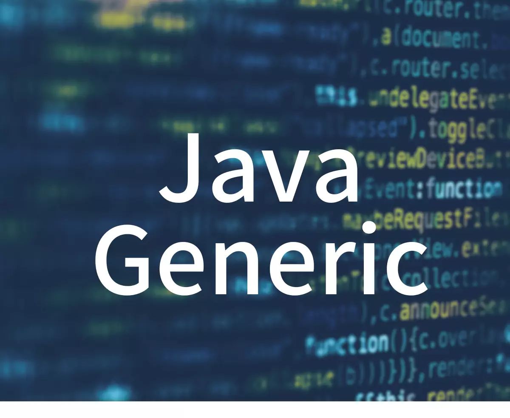
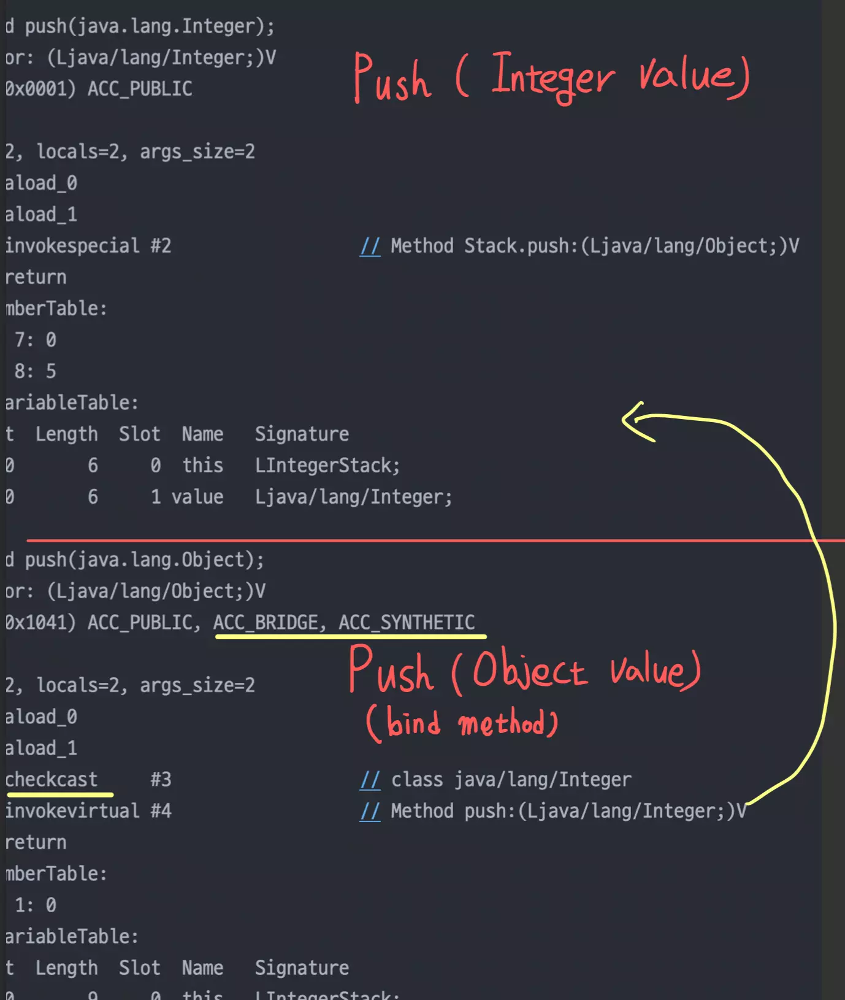

> 제네릭은 1.5 버전에서 등장하였고, 하위 버전과의 호환성을 위한 추가적인 작업이 필요하였다.
> 어떤 작업이 필요할까?



## Type erasure란?
제네릭은 JDK 1.5 버전에 처음 도입 되었다. 그렇다면 이전 버전에서는 제네릭이 도입되기전의 자바 버전의 코드들과의
호환성을 위해 컴파일시에 타입 안정성을 체크한 후 제네릭 타입을 소거한다.
이것을 `Type erasure`라고 한다.

대표적인 예시는 다음과 같다.

[컴파일전]
```java
public static <E> boolean containsElement(E [] elements, E element){
    for (E e : elements){
        if(e.equals(element)){
            return true;
        }
    }
    return false;
}
```

[컴파일후]
```java
public static boolean containsElement(Object [] elements, Object element){
    for (Object e : elements){
        if(e.equals(element)){
            return true;
        }
    }
    return false;
}
```
타입 `E`가 사라지고 `Object`로 치환된 것을 확인할 수 있다.


## Type Erasure의 종류
###  Class Type Erasure
컴파일러 클래스의 타입 파리미터를 `bound` 존재 유무에 따라 다르게 처리한다.

+ `bound`가 없는 경우
```java
public class Stack<E> {
    private E[] stackContent;

    public Stack(int capacity) {
        this.stackContent = (E[]) new Object[capacity];
    }

    public void push(E data) {
        // ..
    }

    public E pop() {
        // ..
    }
}
```
----컴파일 진행----
```java
public class Stack {
    private Object[] stackContent;

    public Stack(int capacity) {
        this.stackContent = (Object[]) new Object[capacity];
    }

    public void push(Object data) {
        // ..
    }

    public Object pop() {
        // ..
    }
}
```
맨처음의 예시와 같이 `E`가 `Object`로 치환 되었다.

+ `bound`가 있는 경우
```java
public class BoundStack<E extends Comparable<E>> {
    private E[] stackContent;

    public BoundStack(int capacity) {
        this.stackContent = (E[]) new Object[capacity];
    }

    public void push(E data) {
        // ..
    }

    public E pop() {
        // ..
    }
}
```
----컴파일 진행----
```java
public class BoundStack {
    private Comparable[] stackContent;

    public BoundStack(int capacity) {
        this.stackContent = (Comparable[]) new Object[capacity];
    }

    public void push(Comparable data) {
        // ..
    }

    public Comparable pop() {
        // ..
    }
}
```
컴파일러가 타입 파라미터를 가장 첫번째 bound(`Comparable`)로 치환한 것을 확인할 수 있다.


### Method Type Erasure
제네릭 메서드에서도 위와 같이 똑같이 동작하므로 생략한다.

### Bridge Method
`Type Erase`의 결과가 다형성을 해치는 경우가 있다. 다음의 예시를 보자

```java
public class Stack<E> {
  private E[] stackContent;

  public Stack(int capacity) {
    this.stackContent = (E[]) new Object[capacity];
  }

  public void push(E value) {
    // ..
  }

  public E pop() {
    // ..
  }
}


public class IntegerStack extends Stack<Integer> {

  public IntegerStack(int capacity) {
    super(capacity);
  }

  @Override
  public void push(Integer value) {
    super.push(value);
  }
}
```
잘 와닿지는 않지만 현재 상황은 <u>제네릭 클래스를 상속</u>받고 있는 상황이다.
`IntegerStack` 입장에서는 `Stack<Integer>`를 상속 받아
`push(Integer value)` 를 오버라이딩 하고 싶었겠지만 현실은 그렇지 않다.


`Stack<E>`클래스의 `type erase` 결과로 `push`메서드의 시그니쳐는
`push(Object value)`가 되기 때문이다.
```java
public class IntegerStack extends Stack<Integer> {

  public IntegerStack(int capacity) {
    super(capacity);
  }

  //Stack<E>로부터 상속 
  public void push(Object value) {
    // ..
  }
  
  public void push(Integer value) {
    super.push(value);
  }
```
즉 컴파일결과 이렇게되고 우리가 원했던 `overriding`이 아닌 `overloading`이 되버린다.
이런 문제를 해결하기위해 컴파일러는 `bind method`를 생성해버린다.
```java
public class IntegerStack extends Stack<Integer> {

  public IntegerStack(int capacity) {
    super(capacity);
  }

  //***********************************bind method
  @Override
  public void push(Object value) {
    push((Integer)value);
  } 
  
  public void push(Integer value) {
    super.push(value);
  }

```
컴파일러가 직접 우리가 원하는 메서드를 호출하게끔 타입변환과 함께 바인드 메서드를 생성해버리는 것이다.
확실한가?
이부분을 확실 하기위해 `IntegerStack`의 클래스파일을 디컴파일해보자.



`ACC_BRIDGE`, `ACC_SYNTHETIC` 플래그를 통해 <u>컴파일러가 생성한 브릿지 메서드임을 확인할수있다.</u>

컴파일러가 숨어서 이런일을 하고 있었다.

---
참고
+ [baeldung - Type Erasure in Java Explained](https://www.baeldung.com/java-type-erasure)
+ [Inpa Dev - 자바 제네릭 타입 소거 컴파일 과정 알아보기](https://inpa.tistory.com/entry/JAVA-%E2%98%95-%EC%A0%9C%EB%84%A4%EB%A6%AD-%ED%83%80%EC%9E%85-%EC%86%8C%EA%B1%B0-%EC%BB%B4%ED%8C%8C%EC%9D%BC-%EA%B3%BC%EC%A0%95-%EC%95%8C%EC%95%84%EB%B3%B4%EA%B8%B0)
