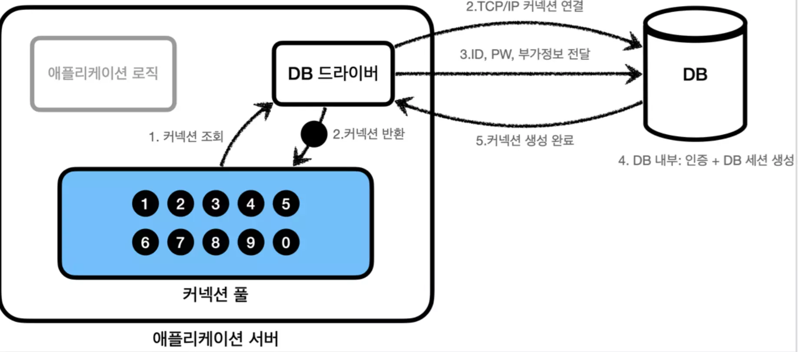
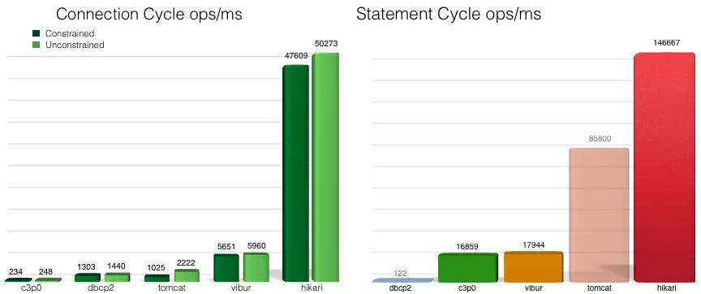

## Hikari CP란?
`hikari CP`는  DB Connection Pool을 구현하는 오픈소스 라이브러리 중 하나로,
성능, 효율성, 안정성 측면에서 우수한 결과를 보여주어 많은 개발자들에게 선호되고 있다.
스프링 부트 버전 2에서 정식으로 지원하는 라이브러리로 채택되었다.

### DB Connection Pool(DBCP)이란?


미리 데이터베이스와의 TCP통신을 통해 일정 개수의 커넥션을 생성하여 보관하고
요청이 들어오면 커넥션 풀 내부의 커넥션을 사용한다. 커넥션의 생성과 삭제의 오버헤드를 줄일 수 있다.


### 성능


위 사진은 `hikari CP` 깃헙에서 확인할 수 있는 다른 커넥션풀 라이브러리들과 비교한 
벤치마크 테스트 결과로, 왼쪽은 `DataSource.getConnection()/Connection.close()`의 성능,
오른쪽은 `Connection.prepareStatement(), Statement.execute(), Statement.close().`의 성능이다.

*성능의 우수함에 굉장히 자부심이 있어보인다..*

## 어떻게 커넥션을 획득하는가? - getConnection() 동작방식
`hikariCP`를 통해 커넥션을 획득하는 방식에대해 알아보자.

```java
public Connection getConnection(final long hardTimeout) throws SQLException {
      suspendResumeLock.acquire();
      final long startTime = currentTime();
    
      try {
         long timeout = hardTimeout;
         do {
            PoolEntry poolEntry = connectionBag.borrow(timeout, MILLISECONDS); 
            // 커넥션 획득.
            //..
         } while (timeout > 0L);
      }
      catch (InterruptedException e) {
          //..
      }
      finally {
         suspendResumeLock.release();
      }
}
```
내부의 일부 로직들 중에서 눈여겨 봐야할 것은

    PoolEntry poolEntry = connectionBag.borrow(timeout, MILLISECONDS); 


이다. `PoolEntry`란 `Connection` 객체를 감싸고 있는 래퍼 클래스이다. `ConnectionBag`은 실제 hikariCP에서 커넥션들을 보관하고 있는 곳이다. 결국 `hikariCP`에게
커넥션을 요청했을때 수행하는 최적화된 로직은 `ConnecctionBag`의 `borrow`메서드에 내부에 존재하고 있다.


`ConnectionBag`의 `borrow` 메서드는 **3단계**에 걸쳐 커넥션을 획득을 유도한다.
1. ThreadLocal에서 사용가능한 커넥션 탐색
2. pool 내 사용가능한 커넥션 탐색
3. 다른 Thread가 쓰고 반납한 커넥션을 대기.

1,2단계에서 커넥션을 획득하였다면 그 즉시 리턴한다. 만약 3단계까지 도달하여 최초 설정된
`CONNECTION_TIMEOUT`을 초과한다면 예외가 발생한다.
각 단계를 코드로 알아보자.

#### 1단계 : ThreadLocal에서 사용가능한 커넥션 탐색
```java
public T borrow(long timeout, final TimeUnit timeUnit) throws InterruptedException
{
      // Try the thread-local list first
      final List<Object> list = threadList.get();
      for (int i = list.size() - 1; i >= 0; i--) {
         final Object entry = list.remove(i);
         @SuppressWarnings("unchecked")
         final T bagEntry = weakThreadLocals ? ((WeakReference<T>) entry).get() : (T) entry;
         if (bagEntry != null && bagEntry.compareAndSet(STATE_NOT_IN_USE, STATE_IN_USE)) {
            return bagEntry;
         }
      }
      // 1단계
      // ..
```
처음부터 풀 내부의 모든 커넥션을 탐색하지 않고, 제일 먼저 커넥션을 요청한 쓰레드의 `Thread local`을 확인한다. 만약 현재 커넥션을 얻고자 하는 `Thread`가 쓰레드 풀에 속한 쓰레드라면
`ThreadLocal`은 `remove`하지 않는 이상 계속해서 유지될 것이다. 바로 이점을 이용한다.
쓰레드가 커넥션을 반납할때 `ThreadLocal`에 저장(기록)한다면, 다시 커넥션을 요청했을때 커넥션 풀을 모두 뒤지지 않아도
`ThreadLocal`에서 사용했던 커넥션들 중에서 탐색하는 것만으로도 사용 가능한 커넥션을 확보 할 수 있는 확률이 높다.

여기서는 `bagEntry`가 커넥션을 의미하는 것으로 봐도 무방하다. 커넥션을 사용하기 위해 상태를 바꾸어줘야하는데
이때는 `CAS`알고리즘을 이용한 동기화 방식을 채택한다.


#### 2단계 : pool 내 사용가능한 커넥션 탐색
```java
public T borrow(long timeout, final TimeUnit timeUnit) throws InterruptedException {
    //1단계 생략

    // Otherwise, scan the shared list ... then poll the handoff queue
    final int waiting = waiters.incrementAndGet();
    try {
        for (T bagEntry : sharedList) {
            if (bagEntry.compareAndSet(STATE_NOT_IN_USE, STATE_IN_USE)) {
        // If we may have stolen another waiter's connection, request another bag add.
                if (waiting > 1) {
                    listener.addBagItem(waiting - 1);
                }
                return bagEntry;
            }  
        }   
        listener.addBagItem(waiting);
        
        //--------
        //3단계..
```
모든 커넥션들은 `ConnectionBag`의

    private final CopyOnWriteArrayList<T> sharedList;

에 저장된다. `CopyOnWriteArrayList`를 사용한 것으로 보아 커넥션의 추가 삭제 작업이 빈번하지 않고,
동기화 된 읽기 작업의 성능을 중요하게 여긴것으로 생각된다.

    if (waiting > 1) {
        listener.addBagItem(waiting - 1);
    }

이부분은 커넥션 풀의 여유공간이 있다면 기다리고 있는 쓰레드(`waiter`)의 수만큼
새로운 커넥션을 추가하는 요청을 하는 동작이다.


#### 3단계 : 다른 Thread가 쓰고 반납한 커넥션을 대기.
```java
public T borrow(long timeout, final TimeUnit timeUnit) throws InterruptedException {
    //1단계 생략

    // Otherwise, scan the shared list ... then poll the handoff queue
    final int waiting = waiters.incrementAndGet();
    try {
        //2단계 생략
        //----
        listener.addBagItem(waiting);

        timeout = timeUnit.toNanos(timeout);
        do {
            final long start = currentTime();
            final T bagEntry = handoffQueue.poll(timeout, NANOSECONDS);
            if (bagEntry == null || bagEntry.compareAndSet(STATE_NOT_IN_USE, STATE_IN_USE)) {
                return bagEntry;
            }

            timeout -= elapsedNanos(start);
        } while (timeout > 10_000);

        return null;
        }
        finally {
        waiters.decrementAndGet();
        }
}
```
1,2단계 까지 커넥션을 획득하지 못한다면 3단계에서 do~while문을 통해 
다른 쓰레드가 반환한 커넥션을 `handOffQueue`에서 `timeout` 시간동안 찾는다. (handoffQueue는 `BlockingQueue`이다.)
이때 `timeout`은 `connectionTimeout`을 의미하며, 디폴트값은 30초이다.

*`hikari CP`의 전체 구현을 알 필요까진 없다고 생각하지만, 실제 `hikari CP`를 사용하면서
가장 크게 체감되는 부분이 커넥션을 획득하는 과정에서 발생하는 오버헤드와 장애들이라고 생각하기에 실제코드를
분석하는 시간을 가졌다.*


## HikariCP Configuration
커넥션 풀을 사용함에 있어서 서버의 규모, 부하 발생여부에 따라
설정을 조절해야한다.
*([Hikari CP 공식 github](https://github.com/brettwooldridge/HikariCP) 참고)*
#### 자주 사용되는 configuration
+ `connectionTimeout`
  + 클라이언트가 풀에서 커넥션을 기다리는 최대의 시간
  + 시간 초과시 `SQLException`발생
  + **Default**: 3000ms(30sec) , 최소 250ms

+ `maximumPoolSize`
  + <u>idle</u> 상태 혹은 <u>in-use</u> 상태의 모든 커넥션들의 최대 숫자.
  + DB와 맺을 수 있는 최대 커넥션를 의미하기도 한다.
  + **Default**: 10

+ `minimumIdle`
  + 커넥션 풀에서 유지하는 최소한의 <u>idle</u> 상태의 커넥션 수
  + `maximumPoolSize`이하에서 커넥션 풀은 `minimumIdle`을 유지한다.
  + **일반적으로 maximumPoolSize와 minimumIdle을 같게** 유지하는 것이 최대성능에 가깝게 동작한다고 설명한다.
  + **Default**: *same as `maximumPoolSize`*

+ `maxLifetime`
  + 커넥션 풀에서 커넥션이 가질수 있는 최대 `lifetime`
  + <u>in-use</u> 상태의 커넥션에서는 초과하여도 remove되지 않으며, 커넥션이 닫힌 상태에서만 제거된다.
  + *We strongly recommend setting this value, and it should be several seconds shorter than any database or infrastructure imposed connection time limit.*
  + 즉, DB나 인프라의 최대 커넥션 시간 보다 몇초 정도 짧게 설정하는 것이 좋다.
  + **Default**: 1800000(30min)

+ `keepaliveTime`
  + 커넥션이 살아있는지에 대한 검사의 주기
  + `maxLifetime`보다 작아야한다.
  + **Default**: 0 (사용하지않음)

  
----


[참고]
+ Hikari CP 소스코드
+ [Hikari CP github](https://github.com/brettwooldridge/HikariCP)
+ [HikariCP Dead lock에서 벗어나기 (이론편)](https://techblog.woowahan.com/2664/)
+ [내가 만든 서비스는 얼마나 많은 사용자가 이용할 수 있을까? - 3편(DB Connection Pool)](https://hyuntaeknote.tistory.com/12)

