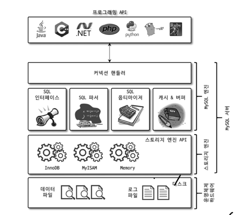
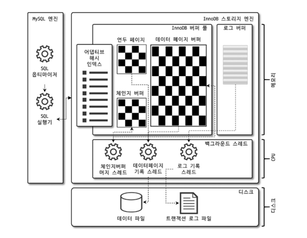
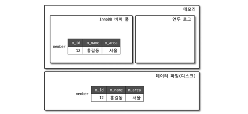
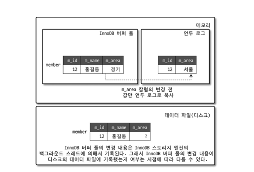
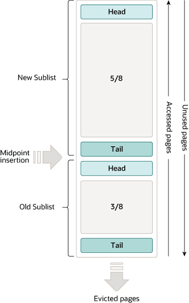
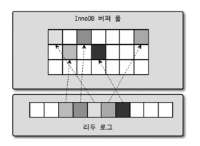
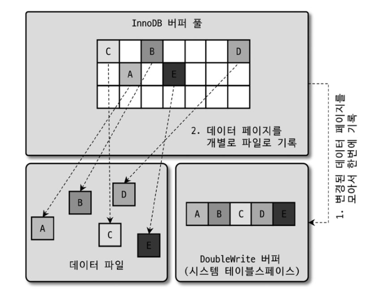

> Mysql 8.0 버전 부터 MySQL 서버의 모든 기능을 InnoDB 스토리지 엔진만으로 구현할 수 있게 되었다. 빠른 읽기 성능에서 큰 장점을 보였던
> MyISAM엔진은 InnoDB 엔진의 성능이 개선되며 도태되어가는 상황이며, 이후 버전에서는 MyISAM 스토리지 엔진은 없어질것으로 예상된다.
> 따라서 InnoDB 스토리지 엔진의 아키텍처를 이해하는 것은 Mysql의 코어한 동작방식을 이해하고 더나아가 DB 성능을 튜닝하는 중요한 과정이다.
> 이글에서는 InnoDB 스토리지의 아키텍처와 특징들을 서술한다.

## Mysql 엔진의 전체적 구조


Mysql의 핵심적인 엔진은 크게 두가지로 구분할 수 있다.
+ Mysql 엔진 : 사람의 머리역할, sql 파싱 및 옵티마이징 등
+ 스토리지 엔진 : 손과 발의 역할, 디스크에 읽기 쓰기 등의 실제 수행을 담당

`InnoDB`, `MyISAM`엔진등은 스토리지 엔진에 해당한다. MYSQL 엔진과 달리 스토리지 엔진은 
여러개를 동시에 상용할 수 있으며 테이블 마다 사용할 스토리지 엔진을 지정할 수 있다. 이후 해당 테이블의
읽기와 변경작업은 지정한 스토리지 엔진이 처리하게된다.

```sql
CREATE TABLE test_table(field1 INT, field2 VARCHAR(255)) ENGINE=INNODB;
```

> MySQL 8.0에서는  스토리지 엔진을 따로 지정하지 않으면 기본 엔진은 InnoDB로 설정된다.

## InnoDB 스토리지 엔진 아키텍처


InnoDB 엔진은 Mysql의 여러 스토리지 엔진 중에서 거의 유일하게 레코드 기반의 잠금을 제공하기때문에
**높은 동시성 처리가 가능하며 안정적이며 성능이 뛰어나다.**


## InnoDB 스토리지 엔진의 특징
### 1. 프라이머리 키에 의한 클러스터링

Cluster: 군집

클러스터는 집합 또는 군집을 나타내는 말로, InnoDB에서 모든 테이블은 프라이머리 키값의 순서대로 군집하여 저장된다. 따라서
모든 세컨더리 인덱스는 프라이머리 키값을 논리적인 주소로 사용한다. 또한 프라이머리키를 이용한 레인지 스캔은 상당히 빨리 처리 될수 있다.

> MyISAM 스토리지 엔진에서는 클러스터링키를 지원하지 않기때문에 프라이머리 키와 세컨더리 인덱스는 구조적으로 아무런 차이가 없다.
> 프라이머리 키를 포함한 모든 인덱슨는 물리적인 레코드의 주소값(ROWID)를 갖는다.


### 2. 외래키 지원
외래키의 지원은 `MyISAM`이나 `MEMORY`테이블에서는 사용할 수 없는 `InnoDB` 스토리지 엔진에서 지원하는 기능이다.
외래키 기능은 다음과 같이 끄고 킬 수 있다.

```sql
SET foreign_key_checks=OFF;

레코드 적재 or 삭제 

SET foreign_key_checks=ON;
```

### 3. MVCC(Multi Version Concurrency Control)
하나의 레코드에 대해 여러개의 버전을 동시에 관리하여 일관된 읽기를 제공한다. 일반적으로 `MVCC`는 레코드레벨의 트랜잭션을 지원하는 DBMS에서
제공되는 기능이며 잠금을 사용하지 않는다는 특징이있다.

예를들어, 다음과 같은 데이터베이스의 상태가 있다고 해보자.


이때, 다음과 같이 update 쿼리를 실행한 다면 다음과 inno DB 엔진은 다음과 같은 상태로 동작한다.
```sql
update member SET m_area='경기' WHERE m_id=12;
```



언두 로그를 활용하여 **변경 전** 데이터를 기록한다.
아직 변경이 커밋 되지 않았다면 트랜잭션 격리 수준에 따라 해당 레코드를 조회하면 다음과 같이 동작한다.
+ READ_UNCOMMITED : InnoDB 버퍼풀의 (변경된)데이터를 반환 --> `경기`
+ READ_COMMITED 이상의 격리 수준 : 언두로그의 (기존)데이터를 반환 `서울`

### 4. 자동화된 장애 복구
MYSQL 서버가 여러이유로 서버가 재시작될때, 완료되지 못한 트랜잭션이나 일부만 기록된 데이터 페이지 등에 대한 일련의 복구 작업이
자동으로 진행된다.

## 버퍼 풀 (Buffer Pool)

InnoDB 스토리지 엔진에서 읽기 및 쓰기 성능과 연결되는 가장 핵심적인 부분으로, 디스크의 데이터파일, 인덱스 정보를 메모리에 **캐시**해 두는 공간 일뿐만 아니라
쓰기 지연을 처리하는 **버퍼** 역할도 수행한다.

### 버퍼풀 크기 및 인스턴스 개수 설정
버퍼풀의 크기는 `innodb_buffer_pool_size` 시스템 변수로 크기를 설정할 수 있우며 128MB 단위로 처리된다.

과거 InnoDB 버퍼풀은 버퍼풀 전체를 관리하는 세마포어로 내부 잠금 경합을 유발해 왔으나, 현재는 여러 개의 작은 버퍼풀로 쪼개지면서 
각각을 관리하는 세마포어를 두어 경합을 분산되는 효과를 낸다. 이때 각 버퍼풀을 **버퍼풀 인스턴스**라고한다.
기본값은 8이며 만약 버퍼풀 전체의 메모리공간이 40GB이상이라면 버퍼풀 인스턴스당 5GB정도가 되게 인스턴스 개수를 설정하는것이 좋다.

### 버퍼풀의 구조 - 캐싱
버퍼풀은 기본적으로 메모리 공간을 **페이지 크기**의 조각으로 쪼개고, 디스크에서 읽어들인 페이지를 각 조각에 저장하는 방식으로 작동한다.
이때 캐시를 관리하기위해 `LRU`알고리즘과 `linked list`를 사용한다. 그림으로 보면 다음과 같다.



버퍼풀은 두개의 영역으로 나뉘게 된다.
+ `New Sublist` : 5/8 만큼의 영역, 자주 사용된 페이지가 저장
+ `Old Sublist` : 3/8 만큼의 영역, 오랫동안 사용되지 않은 페이지가 저장. 사용되지 않은 페이지는 `tail`에 도달하게 되고, 제거된다.

동작방식은 다음과 같다.
1. 새로운 페이지가 버퍼 풀에 로드될 때 **Old Sublist**의 `head`에 먼저 들어갑니다. (3/8 지점에 해당)
2. 이 페이지가 짧은 시간 내에 다시 사용되면 **New Sublist**의 `head`로 이동합니다. 즉, 최근에 사용된 데이터만 진짜 자주 참조되는지 확인한 후에 더 오래 메모리에 남게 됩니다.
3. 단기적으로 자주 사용되지 않은 페이지는 **Old Sublist**에 머물며 계속 `tail`쪽으로 밀려나며 교체된다.

### 버퍼풀과 리두 로그 - 쓰기 버퍼링
InnoDB 버퍼풀의 페이지가 변경이 발생하면 **더티 페이지**라고 부른다. 이때 변경에 대한 행위는 **리두 로그**파일에 로그 엔트리로 기록된다.
더티페이지는 버퍼풀에 영원히 머무를 수 없고, 언젠가는 디스크에 기록되어야한다. 따라서 리두 로그에 어디까지 동기화를 
진행했는지에 대한 표시를 하게 되는데 이것을 **체크 포인트**라고 하며 표시방식은 `LSN`(log sequence number)이다.

버퍼풀에서 더티페이지는 특정 리두로그 엔트리와 관계를 가진다. 따라서 더티페이지의 비율과 리두 로그파일의 전체크기는 서로 연관관계를 가지게 된다.


가령, 버퍼풀의 크기가 100GB이고 리두로그 파일의 전체크기가 100MB인 경우를 생각해보면
평균적인 리두 로그엔트리가 **4KB**라고 했을때, 더티페이지는 25,600개(100MB/4KB)를 가질 수 있고 페이지의크기가
16KB라고 지정되어있다면 전체 더티페이지의 크기는 **400MB** 수준 밖에 되질 않는다.

정리하면 성능을 고려하여 버퍼풀의 크기만 크게 증가시키면 캐싱에서는 이득을 얻을 수 있으나 쓰기 버퍼링에서는 이득을 전혀
얻을 수 없다는 것이다. **따라서 리두 로그 파일의 크기를 적절히 선택**하여 쓰기 버퍼링의 효과를 최대화 시키는 것이 중요하다.


## Double Write Buffer
리두로그는 페이지의 변경된 내용만 기록한다. 따라서 더티페이지를 디스크에 플러쉬할 때 일부만 기록되고 시스템의
비정상적인 종료가 되었을 때 리두로그만 가지고는 해당 더티페이지를 복구 할 수 없다. 이현상을 `파셜 페이지`현상이라고 한다. 

이러한 현상을 해결할 수 있는것이 `double write buffer`이다.


더블 라이트 버퍼는 실제 데이터 파일에 변경 내용을 기록하기전에 `double write buffer`에 한번의 디스크 쓰기로 기록한다.
그리고 엔진의 재시작시 `double writer buffer`의 내용과 다른 페이지와 다른 데이터 파일이 있으면 복사한다.

더블 라이트 버퍼는 데이터의 무결성이 중요한 서비스에서 활성활를 고려할 수 있다.


---
## 참고
- 도서 Real Mysql 8.0
- https://dev.mysql.com/doc/refman/8.4/en/innodb-storage-engine.html
