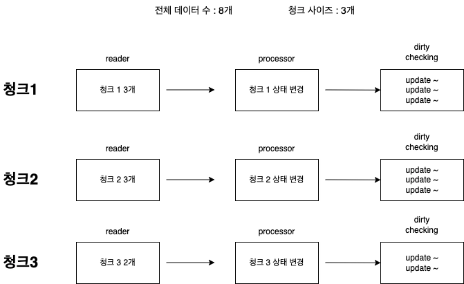
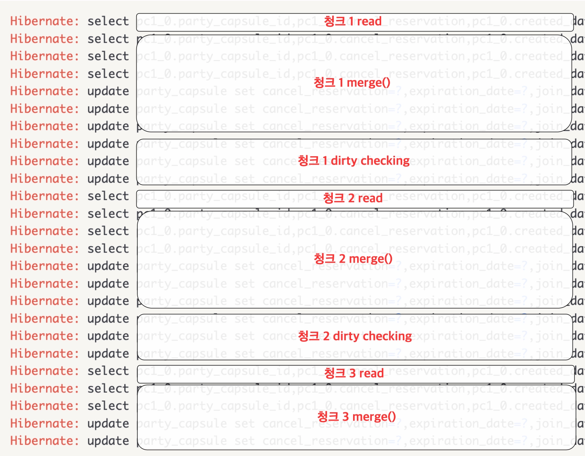
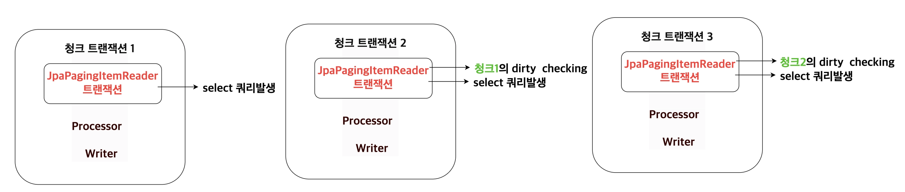

스프링 배치의 step을 구성할때 reader로 어떤 것을 사용할 지 고민이 될 때가 많다. 이때 데이터 접근 기술로 jpa를 사용할 때,
가장 쉽게 고려되는 것 중 하나가 JpaPagingItemReader이다.(Spring-data-jpa를 사용할 시 RepositoryItemReader도 유용하게 쓰인다.)
하지만 쉬운 사용법과 별개로 가끔 우리의 기대와 달리 동작될 때가 있다. 이 글에서는 직접 경험한 사례와 그 원인을 소개한다.

## ❗문제상황 : dirty checking이 이상하게 작동한다.
`JpaPagingItemReader`로 엔티티를 청크단위로 읽어들인 뒤, `processor`에서 엔티티의 상태를 변경시켰을 때, 우리는 `dirty checking`이 
발생할 것이라는 예상을 자연스럽게 하게된다. 

예시 상황은 이렇다.
```java
@Bean
@StepScope
public JpaPagingItemReader<PartyCapsule> testReader() {
    return new JpaPagingItemReaderBuilder<PartyCapsule>()
        .entityManagerFactory(entityManagerFactory)
        .name("testReader")
        .queryString("select pc from PartyCapsule pc where pc.createdDate<:lastDate")
        .parameterValues(Map.of("lastDate", lastDate))
        .pageSize(CHUNKSIZE)
        .build();
}

@Bean
@StepScope
public ItemProcessor<PartyCapsule, PartyCapsule> testProcessor() {
    return partyCapsule -> {
        partyCapsule.changeToOccupy(); //상태를 변경
        return partyCapsule;
    };
}
```
`PartyCapsule`이라는 엔티티를 읽어들이고 processor에서 상태를 변경시켰다. 이제 이것을 데이터베이스에 반영하기 위해 다음의 예시들과 같이 `writer`를 정의하고 각각 결과를 지켜보자.


### 예시 1. 아무동작하지 않는 itemWriter를 재정의
processor 에서 상태를 변경시켰으니 아무것도 하지않고 성공하는 `itemWriter`를 재정의하면 청크가 커밋될때 flush되면서 `dirty checking`이 작동 하지 않을까?

```java
@Bean
@StepScope
public ItemWriter<PartyCapsule> testWriter() {
    return chunk -> {
    };
}
```

만약 총 개수가 **8개**, 청크사이즈 및 페이지사이즈가 **3개**인 경우를 생각해보자.
우리의 예상대로라면 밑의 그림대로 `3개/3개/2개` 의 `update` 쿼리문이 발생해야한다.



하지만 실제 결과는 다음과 같았다
```log 
Hibernate: select pc1_0.party_capsule_id,pc1_0.cancel_reservation,pc1_0.created_date,pc1_0.expiration_date,pc1_0.join_date,pc1_0.modified_date,pc1_0.ott_id,pc1_0.party_id,pc1_0.party_capsule_status,pc1_0.user_id from party_capsule pc1_0 where pc1_0.created_date<? limit ?,?
Hibernate: update party_capsule set cancel_reservation=?,expiration_date=?,join_date=?,modified_date=?,ott_id=?,party_id=?,party_capsule_status=?,user_id=? where party_capsule_id=?
Hibernate: update party_capsule set cancel_reservation=?,expiration_date=?,join_date=?,modified_date=?,ott_id=?,party_id=?,party_capsule_status=?,user_id=? where party_capsule_id=?
Hibernate: update party_capsule set cancel_reservation=?,expiration_date=?,join_date=?,modified_date=?,ott_id=?,party_id=?,party_capsule_status=?,user_id=? where party_capsule_id=?
Hibernate: select pc1_0.party_capsule_id,pc1_0.cancel_reservation,pc1_0.created_date,pc1_0.expiration_date,pc1_0.join_date,pc1_0.modified_date,pc1_0.ott_id,pc1_0.party_id,pc1_0.party_capsule_status,pc1_0.user_id from party_capsule pc1_0 where pc1_0.created_date<? limit ?,?
Hibernate: update party_capsule set cancel_reservation=?,expiration_date=?,join_date=?,modified_date=?,ott_id=?,party_id=?,party_capsule_status=?,user_id=? where party_capsule_id=?
Hibernate: update party_capsule set cancel_reservation=?,expiration_date=?,join_date=?,modified_date=?,ott_id=?,party_id=?,party_capsule_status=?,user_id=? where party_capsule_id=?
Hibernate: update party_capsule set cancel_reservation=?,expiration_date=?,join_date=?,modified_date=?,ott_id=?,party_id=?,party_capsule_status=?,user_id=? where party_capsule_id=?
Hibernate: select pc1_0.party_capsule_id,pc1_0.cancel_reservation,pc1_0.created_date,pc1_0.expiration_date,pc1_0.join_date,pc1_0.modified_date,pc1_0.ott_id,pc1_0.party_id,pc1_0.party_capsule_status,pc1_0.user_id from party_capsule pc1_0 where pc1_0.created_date<? limit ?,?
```
즉 **2번째 청크**까지 `dirty checking`이 발생하고 3번째 청크의 조회 쿼리가 나갔지만 3번째 청크의 `dirty checking`이 발생하지 않았다.

원인을 바로 알아보기 전에 하나의 예시를 더 보기로하자.

### 예시 2. JpaItemWriter 사용
<u>만약 `dirty checking`을 사용하지 않고</u> `JpaItemWriter`를 사용한다면?

```java
@Bean
@StepScope
public JpaItemWriter<PartyCapsule> testWriter2() {
    return new JpaItemWriterBuilder<PartyCapsule>()
        .entityManagerFactory(entityManagerFactory)
        .usePersist(false)
        .build();
}
```

> 참고로 JpaItemWriter의 `usePersist` 속성이 true면 `persist`를 false이면 `merge`를 사용한다.

변경사항을 의도적으로 merge하면?

다음과 같은 상황이벌어진다.
```log
Hibernate: select pc1_0.party_capsule_id,pc1_0.cancel_reservation,pc1_0.created_date,pc1_0.expiration_date,pc1_0.join_date,pc1_0.modified_date,pc1_0.ott_id,pc1_0.party_id,pc1_0.party_capsule_status,pc1_0.user_id from party_capsule pc1_0 where pc1_0.created_date<? limit ?,?
Hibernate: select pc1_0.party_capsule_id,pc1_0.cancel_reservation,pc1_0.created_date,pc1_0.expiration_date,pc1_0.join_date,pc1_0.modified_date,pc1_0.ott_id,pc1_0.party_id,pc1_0.party_capsule_status,pc1_0.user_id from party_capsule pc1_0 where pc1_0.party_capsule_id=?
Hibernate: select pc1_0.party_capsule_id,pc1_0.cancel_reservation,pc1_0.created_date,pc1_0.expiration_date,pc1_0.join_date,pc1_0.modified_date,pc1_0.ott_id,pc1_0.party_id,pc1_0.party_capsule_status,pc1_0.user_id from party_capsule pc1_0 where pc1_0.party_capsule_id=?
Hibernate: select pc1_0.party_capsule_id,pc1_0.cancel_reservation,pc1_0.created_date,pc1_0.expiration_date,pc1_0.join_date,pc1_0.modified_date,pc1_0.ott_id,pc1_0.party_id,pc1_0.party_capsule_status,pc1_0.user_id from party_capsule pc1_0 where pc1_0.party_capsule_id=?
Hibernate: update party_capsule set cancel_reservation=?,expiration_date=?,join_date=?,modified_date=?,ott_id=?,party_id=?,party_capsule_status=?,user_id=? where party_capsule_id=?
Hibernate: update party_capsule set cancel_reservation=?,expiration_date=?,join_date=?,modified_date=?,ott_id=?,party_id=?,party_capsule_status=?,user_id=? where party_capsule_id=?
Hibernate: update party_capsule set cancel_reservation=?,expiration_date=?,join_date=?,modified_date=?,ott_id=?,party_id=?,party_capsule_status=?,user_id=? where party_capsule_id=?
Hibernate: update party_capsule set cancel_reservation=?,expiration_date=?,join_date=?,modified_date=?,ott_id=?,party_id=?,party_capsule_status=?,user_id=? where party_capsule_id=?
Hibernate: update party_capsule set cancel_reservation=?,expiration_date=?,join_date=?,modified_date=?,ott_id=?,party_id=?,party_capsule_status=?,user_id=? where party_capsule_id=?
Hibernate: update party_capsule set cancel_reservation=?,expiration_date=?,join_date=?,modified_date=?,ott_id=?,party_id=?,party_capsule_status=?,user_id=? where party_capsule_id=?
Hibernate: select pc1_0.party_capsule_id,pc1_0.cancel_reservation,pc1_0.created_date,pc1_0.expiration_date,pc1_0.join_date,pc1_0.modified_date,pc1_0.ott_id,pc1_0.party_id,pc1_0.party_capsule_status,pc1_0.user_id from party_capsule pc1_0 where pc1_0.created_date<? limit ?,?
Hibernate: select pc1_0.party_capsule_id,pc1_0.cancel_reservation,pc1_0.created_date,pc1_0.expiration_date,pc1_0.join_date,pc1_0.modified_date,pc1_0.ott_id,pc1_0.party_id,pc1_0.party_capsule_status,pc1_0.user_id from party_capsule pc1_0 where pc1_0.party_capsule_id=?
Hibernate: select pc1_0.party_capsule_id,pc1_0.cancel_reservation,pc1_0.created_date,pc1_0.expiration_date,pc1_0.join_date,pc1_0.modified_date,pc1_0.ott_id,pc1_0.party_id,pc1_0.party_capsule_status,pc1_0.user_id from party_capsule pc1_0 where pc1_0.party_capsule_id=?
Hibernate: select pc1_0.party_capsule_id,pc1_0.cancel_reservation,pc1_0.created_date,pc1_0.expiration_date,pc1_0.join_date,pc1_0.modified_date,pc1_0.ott_id,pc1_0.party_id,pc1_0.party_capsule_status,pc1_0.user_id from party_capsule pc1_0 where pc1_0.party_capsule_id=?
Hibernate: update party_capsule set cancel_reservation=?,expiration_date=?,join_date=?,modified_date=?,ott_id=?,party_id=?,party_capsule_status=?,user_id=? where party_capsule_id=?
Hibernate: update party_capsule set cancel_reservation=?,expiration_date=?,join_date=?,modified_date=?,ott_id=?,party_id=?,party_capsule_status=?,user_id=? where party_capsule_id=?
Hibernate: update party_capsule set cancel_reservation=?,expiration_date=?,join_date=?,modified_date=?,ott_id=?,party_id=?,party_capsule_status=?,user_id=? where party_capsule_id=?
Hibernate: update party_capsule set cancel_reservation=?,expiration_date=?,join_date=?,modified_date=?,ott_id=?,party_id=?,party_capsule_status=?,user_id=? where party_capsule_id=?
Hibernate: update party_capsule set cancel_reservation=?,expiration_date=?,join_date=?,modified_date=?,ott_id=?,party_id=?,party_capsule_status=?,user_id=? where party_capsule_id=?
Hibernate: update party_capsule set cancel_reservation=?,expiration_date=?,join_date=?,modified_date=?,ott_id=?,party_id=?,party_capsule_status=?,user_id=? where party_capsule_id=?
Hibernate: select pc1_0.party_capsule_id,pc1_0.cancel_reservation,pc1_0.created_date,pc1_0.expiration_date,pc1_0.join_date,pc1_0.modified_date,pc1_0.ott_id,pc1_0.party_id,pc1_0.party_capsule_status,pc1_0.user_id from party_capsule pc1_0 where pc1_0.created_date<? limit ?,?
Hibernate: select pc1_0.party_capsule_id,pc1_0.cancel_reservation,pc1_0.created_date,pc1_0.expiration_date,pc1_0.join_date,pc1_0.modified_date,pc1_0.ott_id,pc1_0.party_id,pc1_0.party_capsule_status,pc1_0.user_id from party_capsule pc1_0 where pc1_0.party_capsule_id=?
Hibernate: select pc1_0.party_capsule_id,pc1_0.cancel_reservation,pc1_0.created_date,pc1_0.expiration_date,pc1_0.join_date,pc1_0.modified_date,pc1_0.ott_id,pc1_0.party_id,pc1_0.party_capsule_status,pc1_0.user_id from party_capsule pc1_0 where pc1_0.party_capsule_id=?
Hibernate: update party_capsule set cancel_reservation=?,expiration_date=?,join_date=?,modified_date=?,ott_id=?,party_id=?,party_capsule_status=?,user_id=? where party_capsule_id=?
Hibernate: update party_capsule set cancel_reservation=?,expiration_date=?,join_date=?,modified_date=?,ott_id=?,party_id=?,party_capsule_status=?,user_id=? where party_capsule_id=?
```

예시1과 비교하면 이번엔 **과다하게 쿼리문이 많아져버렸다.** 또 예제 1과달리 마지막 세번째 청크에서 `update`쿼리가 2개 제대로 나가고 있다.
곧 이러한 현상들의 원인을 살펴볼테지만 각 쿼리의 출처는 다음과 같다. 



여기서 힌트를 찾을 수 있다. `entitymanager.merge()`는 1차캐시에 없을 시 DB에서 조회하는 쿼리를 날린다.
즉 위의 상황을 미루어보아, 우리가 `read`를 한 엔티티들은 `merge`되는 시점에 1차캐시에 존재 하지 않는다는 말이 된다.

### 원인 분석
사실 이 모든 문제의 원인은 `JpaPagingItemReader`의 내부동작에 있다. 주요한 부분만 보면 다음과 같다.

```java
public class JpaPagingItemReader<T> extends AbstractPagingItemReader<T> {
	//생략
    protected void doReadPage() {
		EntityTransaction tx = null;
		if (this.transacted) { //default -> true
			tx = this.entityManager.getTransaction();
			tx.begin();
			this.entityManager.flush();
			this.entityManager.clear();
		}
        //생략.

		tx.commit();
	}
}
```

해당 메서드는 새로운 페이지를 조회할때 호출 되는 메서드이다. 우리는 이 코드에서 두가지를 알 수 있다.

1. **별도의 트랜잭션 생성**

가장 시작 부분에서 새로운 **트랜잭션**을 생성한다.(물론 `transacted`옵션을 false로 줘서 트랜잭션자체를 사용안할 수도 있다.)
그리고 메서드의 마지막에서 트랜잭션을 커밋한다. 즉 **청크 단위의 트랜잭션과 별개의 트랜잭션**으로 엔티티들을 `read`하고 있는 것이다.

>대부분의 PagingItemReader는 트랜잭션을 청크에게 위임한다.(내부에서 트랜잭션을 따로 생성하지 않는다.)


2. **flush() 호출**

내부에서 다음 페이지 조회 쿼리를 호출하기전 `entityManager`의 `flush`메서드를 호출한다. `flush` 메서드는 영속성 컨텍스트의 변경사항을
db에 반영하게한다.

이제, 이 두가지 사실을 가지고 예제1과 예제2번의 현상을 설명할 수 있게 된다. 

#### ✓ 예제 1 분석 - 청크 3의 update쿼리가 나가지 않는 현상
청크 단위의 트랜잭션과 독립되는 트랜잭션안에서 엔티티가 조회된다. 따라서 `writer`실행 후에 청크 트랜잭션의 커밋이 일어나도
`reader` 내부의 엔티티 매니저에서 `flush`가 호출되지 않는다. 

그러나 `reader`내부에서 `flush`를 명시적으로 호출하고 있기때문에 바로 이지점에서 `dirty cheking`이 발생한 것이다.
순서로 보면 다음과 같다.



즉 내부에서 트랜잭션을 관리하고 있는 탓에 청크 트랜잭션의 커밋이 영향을 미치지 못하여, 다음 청크에서 이전 청크의 `dirty checking`이 `flush`에 의하여
호출 되고 있다. 결국 마지막 페이지에 도달하면 다음 페이지는 존재하지않기 때문에 `reader`가 종료되어 `dirty cheking`이 발생하지않고
예시1처럼 `3/3/2`가아닌 `3/3`의 update 쿼리문이 발생하게 된 것이다.

#### ✓ 예제 2 분석 - 쿼리문 뻥튀기

이것 또한 트랜잭션에 의한 차이이다. `JpaPagingItemReader`와 `JpaItemWriter`의 엔티티 매니저가 서로 다른 트랜잭션엔 속하며 
**엔티티 매니저와 영속성 컨텍스트 또한 상이한 상태이다**.

이것은 곧 `JpaPagingItemReader`에서 읽은 엔티티들이  `JpaItemWriter`에서 엔티티 매니저에는 비영속 상태로 분류되기때문에
`select`쿼리와 `update`쿼리가 각각 나가며 `merge`된 것이다.

여기에 더해 `reader`에서 `flush`가 호출 되기때문에 예시1과 같은 `dirty cheking`까지 발생해버려서 이러한 쿼리뻥튀기가 일어난 것이다.

> [엔티티 매니저 생성 방식의 차이]
>
> + `JpaPagingItemReader`는 `EntityManagerFactory`를 주입받아 `createEntityManager()`를 호출하여 엔티티 매니저 인스턴스를 생성한다. 이후 계속해서 재사용한다.
> + `JpaItemWriter`는 `EntityManagerFactory`를 주입받아 `EntityManagerFactoryUtils.getTransactionalEntityManager`를 호출하여 트랜잭션 컨텍스트의 경계 내에 생성된
>엔티티 매니저를 매번 찾아서 가져오는 형식이다.


### 🔨해결책
사실 근본적인 해결책은..없다. 하지만 몇가지 선택사항이 존재한다.

굳이 `dirty checking`이 필요하다면
+ `RepositoryItemReader`를 사용하면 된다. -> 트랜잭션을 청크 트랜잭션에게 맡김
+ `JpaPagingItemReader`의 커스텀화 시켜 내부 트랜잭션을 없애 버린다. -> 검증 되지 않음  (이후 글에서 실제 커스텀 한 Reader를 개발해 보았다)

성능면만 고려한다면 Jdbc `batch update`같이 쿼리를 모아서 호출하는 방법등을 고려해볼 수 있기 때문에 
실무에서 과연 사용될까라는 의문점이 남는다. 

---

### 참고
+ <a href="https://jojoldu.tistory.com/414" target="_blank">Spring Batch JPA에서 N+1 문제 해결 - 이동욱님 블로그</a>


