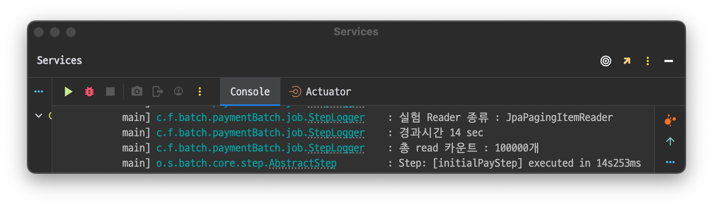
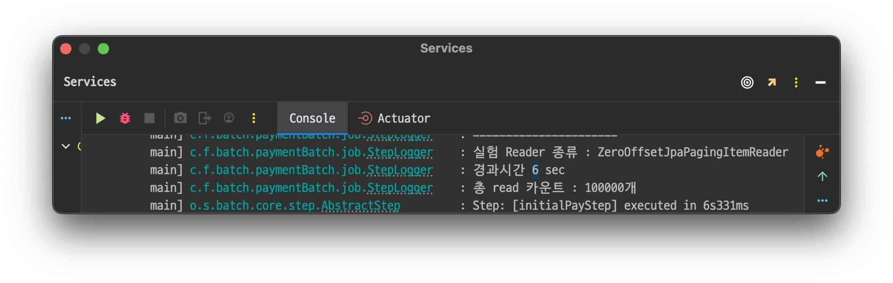
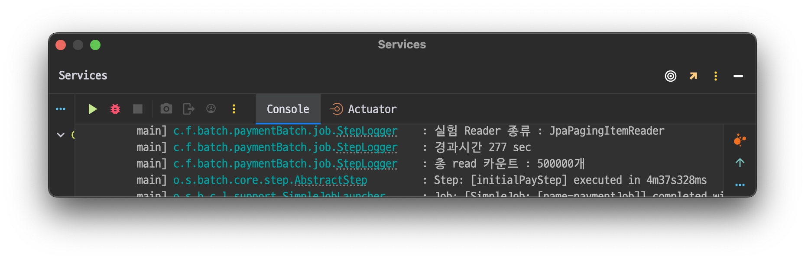
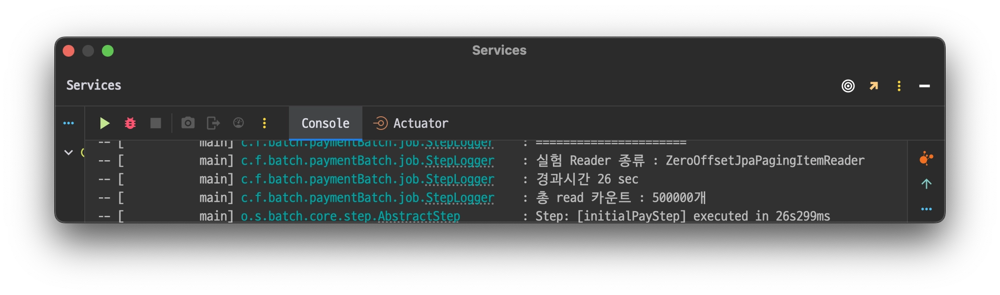
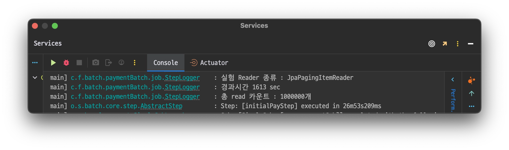
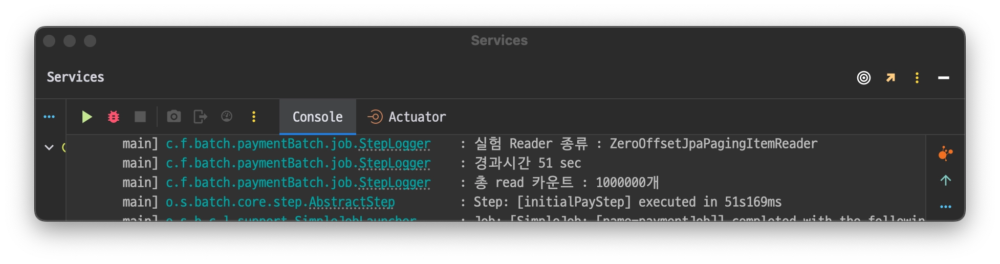
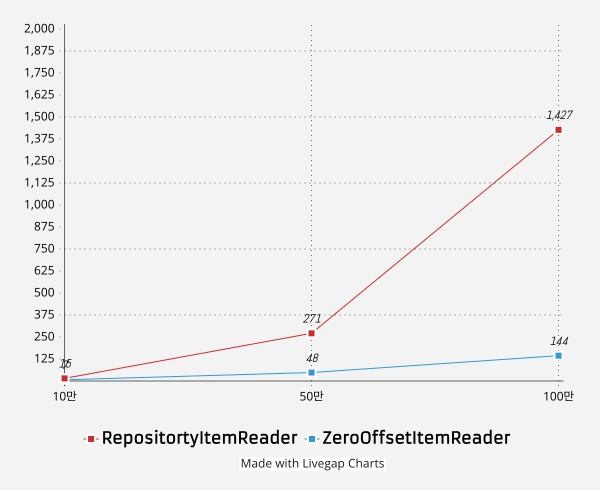

지난 글에서 직접 커스텀하여 만들었던 커스텀 reader를 JpaPagingItemReader와 비교했을때
어느 정도 성능 차이를 보여주는지 테스트 해보려고 한다. 테스트는 로컬 환경에서 진행했으며, 테스트 설정 환경은 다음과 같다.

+ 하나의 `job` 하나의 step 안에 `reader` , `writer`로 구성
+ writer는 실제 비즈니스 로직이 아닌 `I/O`없이 단순히 로그 찍는 용도로 대체하여 `reader`만 갈아끼우면서 테스트 진행
+ reader의 경우 동일한 `Jpql`을 사용
+ `chunk size`는 1000으로 고정

## 1. 실행 코드
- `JpaPagingItemReader`
```java
@Bean
@StepScope
public JpaPagingItemReader<PartyCapsule> jpaPagingItemReader() {
    return new JpaPagingItemReaderBuilder<PartyCapsule>()
        .name("JpaPagingItemReader")
        .queryString(
            "select pc from PartyCapsule pc join fetch pc.partyMember where pc.partyCapsuleStatus=:status")
        .parameterValues(Map.of("status", parameter.getStatus()))
        .entityManagerFactory(entityManagerFactory)
        .pageSize(CHUNKSIZE)
        .build();
}
```

- `ZeroOffsetJpaPagingItemReader`
```java
@Bean
@StepScope
public ZeroOffsetJpaPagingItemReader<PartyCapsule> zeroOffsetJpaPagingItemReader() {
    return new ZeroOffsetJpaPagingItemReaderBuilder<PartyCapsule>()
        .entityClass(PartyCapsule.class)
        .name("ZeroOffsetJpaPagingItemReader")
        .queryString(
            "select pc from PartyCapsule pc join fetch pc.partyMember where pc.partyCapsuleStatus=:status")
        .parameterValues(Map.of("status", parameter.getStatus()))
        .pageSize(CHUNKSIZE)
        .build();
}
```

step 설정시 해당 reader만 교체하면서 테스트를 진행 했다.


## 2. 테스트 시작
테스트는 총 read하는 데이터 개수를 <u>10만개, 50만개 , 100만개</u> 순으로 각각 진행하며 경과 시간을 기록하는 식으로 진행한다.

### 결과 로그 출력 - stepLister 활용
결과 로그는 step의 종료시 호출 하는 `stepLister`를 만들어서 `reader`의 이름과 최종 경과 시간을 출력하도록했다.
```java
public ExitStatus afterStep(StepExecution stepExecution) {
    end = System.currentTimeMillis();
    log.info("======================");
    log.info("실험 Reader 종류 : {}", getItemReaderName(stepExecution));
    log.info("경과시간 {} sec", (end - start) / 1000);
    log.info("총 read 카운트 : {}개", stepExecution.getReadCount());
    return stepExecution.getExitStatus();
}
```

### 2-1 [10만]개 read 테스트
1. `JpaPagingItemReader`

경과 시간: **14초**

2. `ZeroOffsetJpaPagingItemReader`

경과 시간: **6초**

### 2-2 [50만]개 read 테스트
1. `JpaPagingItemReader`
경과 시간: **277초**

2. `ZeroOffsetJpaPagingItemReader`
경과 시간: **26초**


### 2-3 [100만]개 read 테스트
1. `JpaPagingItemReader`

경과 시간: **1613초**

2. `ZeroOffsetJpaPagingItemReader`

경과 시간: **51초**

### 3. 결과 정리


`ZeroOffsetJpaPagingItemReader`가 선형적인 그래프를 그리는 반면 `JpaPagingItemReader`는 건너 뛰어야하는 데이터 수가 커질 수록
경과시간이 기하급수적으로 뛰는것을 확인할 수 있었다.

개인적으로 10만개까지는 둘의 차이가 크지 않았지만 실제 체감상 20만개가 넘어가는 순간부터 `JpaPagingItemReader`가 급격히 느려지는 것을 확인했다.

### 4. 결론
이렇게 해서 기존의 `JpaPagingItemReader`가 가지고 있던 성능적 문제점을 보완하는 커스텀 `reader`를 개발하고, 테스트까지 해보았다.
위의 결과 정리에서 느꼈던 것처럼 read하는 데이터 수 가 총 10만개 이내라면 굳이 검증이 되지 않은 내가 만든 커스텀 reader를 사용할 이유는 딱히 없다.
하지만 배치 프로그램이 실무에 적용될 때, 수많은 `step`으로 파이프라인화 되는 경우가 많을 것이며 이때 `reader`의 성능은 
최종 배치 퍼포먼스에 굉장히 유의미한 영향을 미칠 것이라고 예상한다. 


