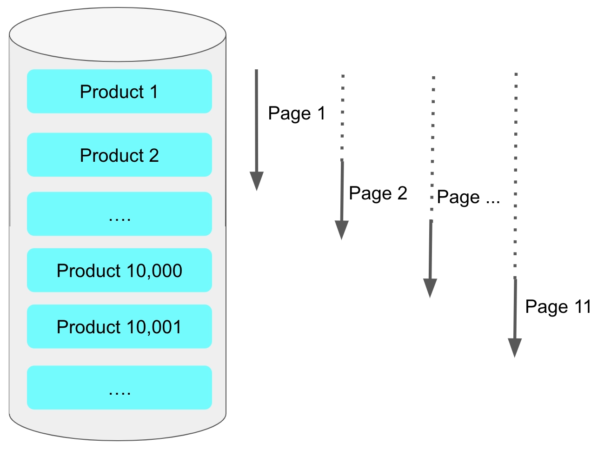

스프링 배치 어플리케이션의 퍼포먼스를 향상시키는 여러 주안점 중 가장 크게 고려 되어야할 부분은 `I/O` 병목 지점을 파악하여 개선하는 것이라고 생각한다.
배치 어플리케이션은 하나의 `step` 내부에서 크게 데이터를 읽어 들이는 `Reader`와 수정 혹은 삽입등을 수행하는 `Writer`로 나뉘어진다.
하나의 배치 어플리케이션은 보통 연속된 파이프라인으로 여러 `Step`으로 구성되므로 `Reader`와 `Writer`의 성능은 곧 배치 퍼포먼스에 크게 영향을 미친다.

## 1. 기존 페이징 기반 ItemReader 동작방식
배치 퍼포먼스 개선에 대한 아티클을 확인하던 중 눈길을 끌었던 것은

카카오 기술블로그에 올라온 <a href="https://tech.kakaopay.com/post/ifkakao2022-batch-performance-read/" target="_blank">[if kakao 2022] Batch Performance를 고려한 최선의 Reader</a>라는 글이였다.

해당 글에서는 스프링 배치에서 제공하는 여러 `ItemReader`중 페이징 처리 기반의 `ItemReader`가 가지는 성능 저하의 문제점을 이야기하고 있다.
페이징 처리기반의 `ItemReader`들은 최종적으로 데이터 베이스에(mysql 기준) 다음과 같은 질의를 하게된다.

```sql
select *
from order
where order_status = 'waiting'
limit 0,1000;

select *
from order
where order_status = 'waiting'
limit 1000,1000;
```
일반적인 페이징 기법과 같이 limit의 시작점을 `PageSize`(일반적으로 `chunk size`)만큼 더해가며 연속해서 페이지를 읽어들이며
, 청크단위의 배치 작업을 수행하게된다.

## 2. Limit 방식의 한계점
사실 페이징 기법은 스프링 배치 뿐만이 아니라 다양한 곳에서 널리 사용되는 방식이지만,
`mysql`의 `Limit`방식의 페이징 방식은 성능적 한계가 존재한다.

```sql 
select *
from order
where 조건
ORDER BY id ASC
limit 시작행 , 페이지크기;
```
의 페이징 쿼리를 요청하면, 시작행이후부터 읽어들여야하므로 가장 먼저 `시작행`만큼을 읽어들이면서 건너뛴 후, `페이지크기`만큼 
데이터를 긁어와야한다.



```sql 
select *
from order
where 조건
ORDER BY id ASC
limit 10000 , 100;
```
이라면 내가 필요한 행의 개수는 최종적으로 100개이하이지만, 이 100개 이하의 행들을 읽어 들이기 위해
10000개의 행을 거쳐야하는 것이다. 따라서 시작행이 커질수록 쿼리 실행속도는 **기하급수적으로 느려진다.**

스프링 배치에서 제공하는 페이지 방식의 `ItemReader`는 모두 최종적으로 위와 같이 동작하기 때문에 같은 성능 저하가 발생한다.


## 3. ZeroOffset 방식
사실 이 문제에 대한 해결책은 페이징 기법이 많이 쓰이는 만큼 널리 알려져있다. `ZeroOffset`혹은 `NoOffset` 방식으로 불리는 이 방식은 
기존의 limit 방식에서 시작행까지 단계적으로 움직인것과 달리,
조건절에 출발지점을 클러스터 인덱스(일반적으로 `PK`)로 명시하여 해당 지점까지 빠르게 이동하여
무조건 첫페이지만 읽게하는 방법이다.

> 비유를 하자면 
> 300페이지 책에서 178페이지를 펼치기위해
> 1쪽부터 178페이지까지 넘겨가며 도달하는 것과
> 목차의 명시된 페이지로 찾아가는 것의 차이와 비슷하다.
> (물론 정확한 비유는 아니다..)

```sql
select *
from order
where id > 마지막 조회_ID
ORDER BY id ASC
limit 0, 페이지크기
```
(limit 절에 0을 포함하든 , 포함하지않고 페이지 크기만 명시하던 결과는 같다)
핵심아이디어는 가장 최근 읽어온 결과에서 `order by`에 맞게 정렬된 값중 가장 마지막 값을 
다음 쿼리의 `마지막 조회_ID`에 파라미터로 넘기는 것이다.

그렇다면 스프링 배치에서 `ItemReader`가 위와 같은 방법으로 동작하게 하여 
배치 퍼포먼스를 향상 시킬 수 있을까?

실제로 이 글의 작성하는데 도움이 된 <a href="https://tech.kakaopay.com/post/ifkakao2022-batch-performance-read/" target="_blank">[if kakao 2022] Batch Performance를 고려한 최선의 Reader</a>
글의 작성자분이 이렇게 말한다.
> 이런 방식이면 offset이 항상 0이기 때문에 쿼리 조회 속도가 느려지지 않게 됩니다. 배치를 구현할 때 ZeroOffsetItemReader를 메인으로 사용하고 있습니다.

아쉽게도 `ZeroOffsetItemReader`는 스프링 배치 프레임워크에서 직접적으로 제공하는 reader가 아니기때문에 직접 구현하는 수 밖에 없다. 이제 나의 목표는
실제로 `ZeroOffsetItemReader`를 구현해보고, 기존 페이징 방식의 `itemReader`와 성능 비교를 해보는 것이다.
---
### 참고
+ <a href="https://tech.kakaopay.com/post/ifkakao2022-batch-performance-read/" target="_blank">[if kakao 2022] Batch Performance를 고려한 최선의 Reader</a>
+ <a href="https://jojoldu.tistory.com/528" target="_blank">1. 페이징 성능 개선하기 - No Offset 사용하기</a>


